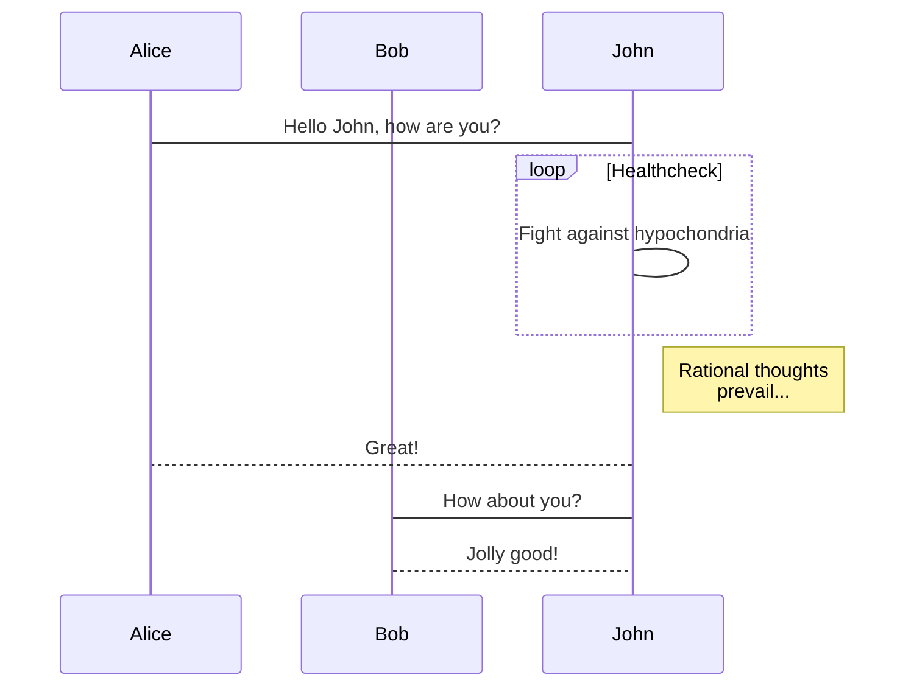

* content
{:toc}

## Jekyll kramdown

## Math

<mark>$$f_{x1}^{y}$$</mark>

<!-- <mark style="color:yellow">$$f_{x}^{y}$$</mark> -->

<!-- 
$$f_{x}^{y}$$
 -->

<ins style="background:yellow">$$f_{x2}^{y}$$</ins>

    <ins style="background:yellow">$$f_{x2.1}^{y}$$</ins>

    <ins style="background:yellow">$$f_{x2.3}^{y}$$</ins>

    

        $$f_{x3}^{y}$$ 
        <ins style="background:yellow">$$f_{x2.2}^{y}$$</ins>
    

<!-- 

    2 $$f_{x}^{y}$$

    
3 $$f_{x}^{y}$$

    

        4 $$f_{x}^{y}$$
    

 -->

### MathJax

### KaTeX

## Graph

### mermaid

## Jekyll tricks

### tags 中添加空格

`AB&#160;C` 展示为：`AB C`

