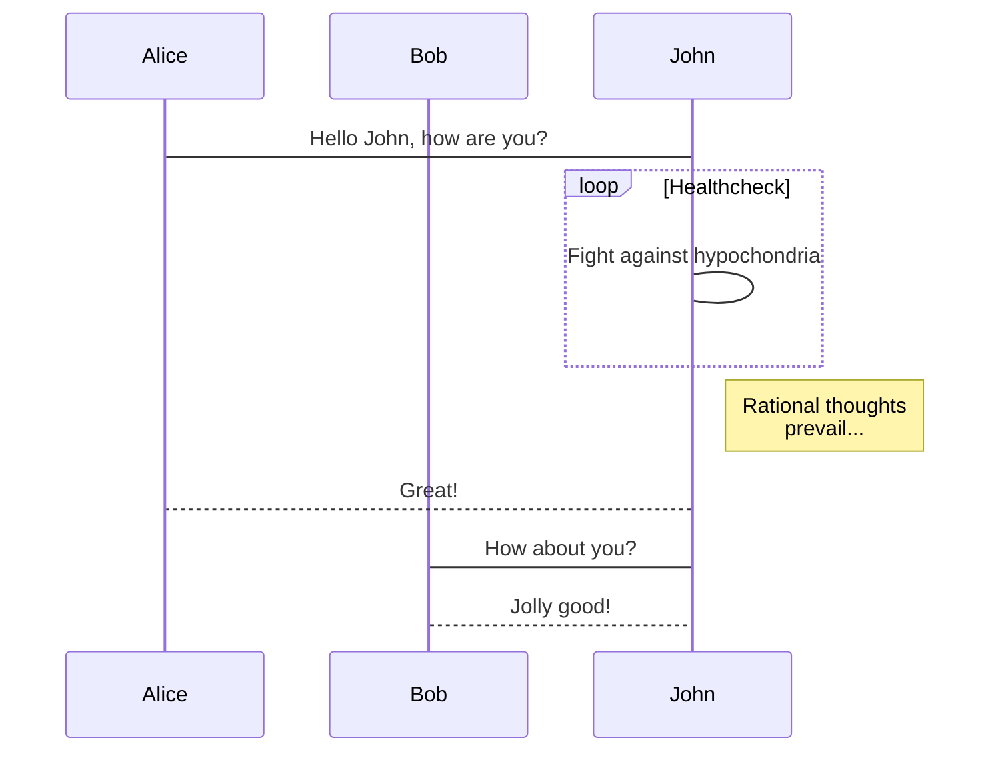

* content
{:toc}

## Jekyll kramdown

## Math

    $$f_{x}^{y}$$

<mark>$$f_{x}^{y}$$</mark>

### MathJax

### KaTeX

## Graph

### mermaid

## Jekyll tricks

### tags 中添加空格

`AB&#160;C` 展示为：`AB C`

